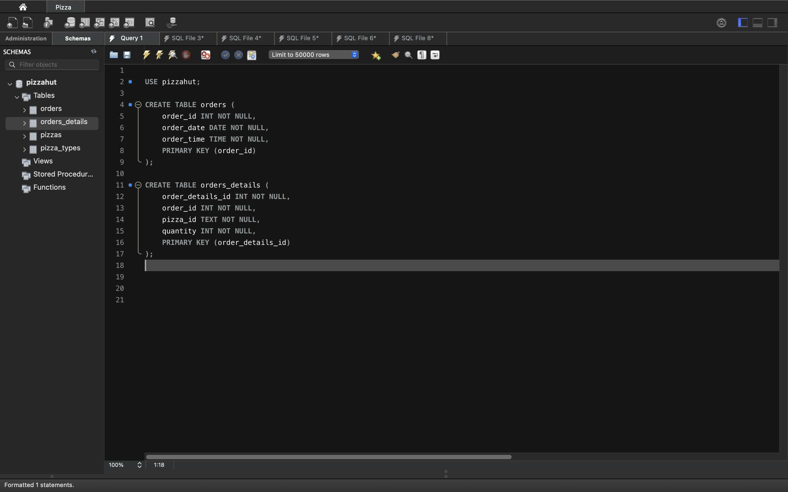

# 🍕 Pizza Sales Analysis using SQL

## 📌 Project Description

This project explores a real-world pizza sales dataset to uncover business insights using **MySQL**. Through structured querying and relational joins, we analyze sales performance, customer behavior, and revenue breakdowns.

---

## 🧰 Tech Stack

- **SQL (MySQL Workbench)** – Data querying and analysis  
- **CSV Files** – Used as raw data inputs  
- **DB Schema Design** – Tables created using SQL  
- **Screenshots** – Output captured for visualization

---

## 📂 Dataset Overview

The data consists of the following files:

| File | Description |
|------|-------------|
| `orders.csv` | Contains order ID, date, and time |
| `order_details.csv` | Maps orders to pizzas and quantity |
| `pizzas.csv` | Contains pizza ID, size, type ID, and price |
| `pizza_types.csv` | Maps pizza types to names and categories |

---

## 🧾 ER Diagram (Simplified)

```
orders(order_id, order_date, order_time)
   ⬇
order_details(order_details_id, order_id, pizza_id, quantity)
   ⬇
pizzas(pizza_id, size, price, pizza_type_id)
   ⬇
pizza_types(pizza_type_id, name, category)
```

---

## 📊 Insights & Metrics

- **Total Orders:** `21,350`
- **Total Revenue:** `$81,760.05`
- **Highest Priced Pizza:** `The Greek Pizza – $35.95`
- **Most Common Pizza Size Ordered:** `Large (L)`
- **Pizza Category by Quantity:**
  - Classic: 14,888  
  - Supreme: 11,987  
  - Veggie: 11,649  
  - Chicken: 11,050
- **Orders by Hour (Peak Time):**
  - Most orders between 12:00 PM – 8:00 PM, with peak at 1:00 PM and 6:00–7:00 PM.
- **Category-wise Pizza Count:**
  - Chicken: 6 types  
  - Classic: 8 types  
  - Supreme: 9 types  
  - Veggie: 9 types
- **Average Pizzas Ordered Per Day:** `138`

---

## 🖼️ Screenshot Highlights

### 📌 1. Table Creation Script
**Image:**   
Creates the base schema with `orders` and `order_details` tables.

### 📌 2. Total Orders Query
**Image:**   
Counts the number of unique orders placed.

### 📌 3. Total Revenue from Sales
**Image:**   
Calculates the total revenue generated using quantity and price.

### 📌 4. Highest Priced Pizza
**Image:**   
Finds the pizza with the maximum price.

### 📌 5. Most Common Pizza Size
**Image:**   
Groups pizza orders by size and orders them by frequency.

### 📌 6. Pizza Category by Quantity
**Image:**   
Displays the total quantity of pizzas ordered by category.

### 📌 7. Order Time Distribution
**Image:**   
Visualizes order distribution across hours of the day.

### 📌 8. Category-wise Pizza Count
**Image:**   
Counts the number of pizzas available in each category.

### 📌 9. Average Pizzas Ordered per Day
**Image:**   
Calculates the average number of pizzas ordered per day.

---

## 📁 Project Structure

```
Pizza-Sales-Analysis/
├── data/
│   ├── orders.csv
│   ├── order_details.csv
│   ├── pizzas.csv
│   └── pizza_types.csv
├── screenshots/
│   └── 1.png to 10.png
├── Questions.txt
└── README.md
```

---

## 🚀 How to Use

1. Import CSV files into a MySQL database.
2. Run table creation SQL script (refer to `1.png`).
3. Execute the SQL queries as shown in the screenshots.
4. Analyze the outputs and derive insights or visualize in BI tools.

---

## 📬 Contact

Built by **Tejas Ubale**  
📧 Feel free to connect via [LinkedIn](#) or drop a message for collaboration.

---
